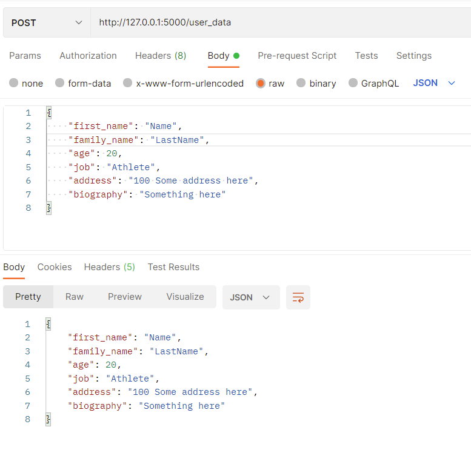
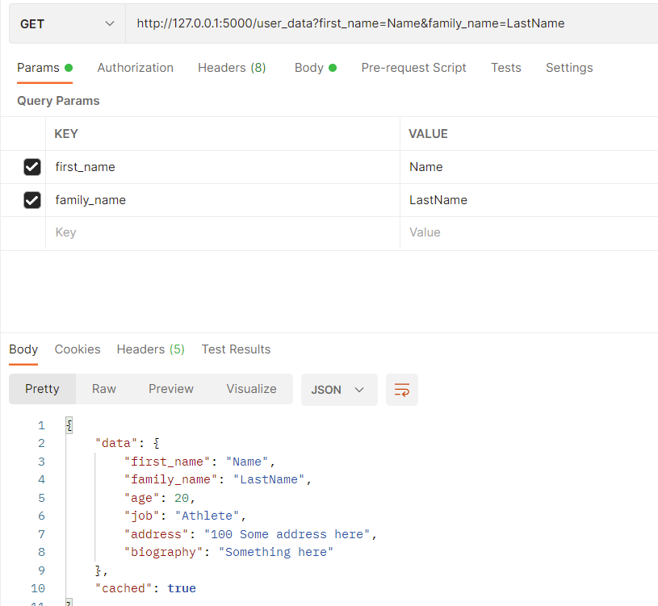
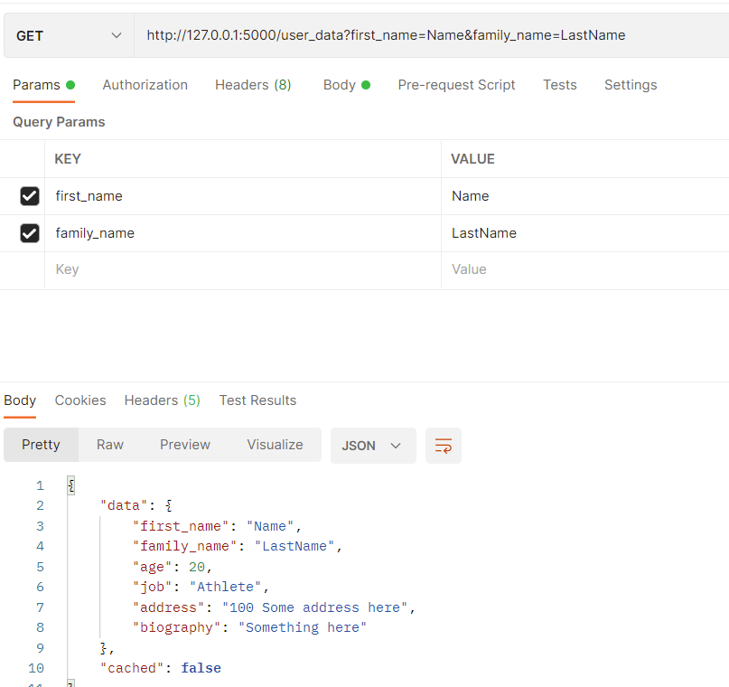
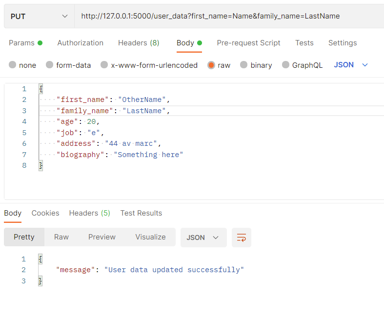
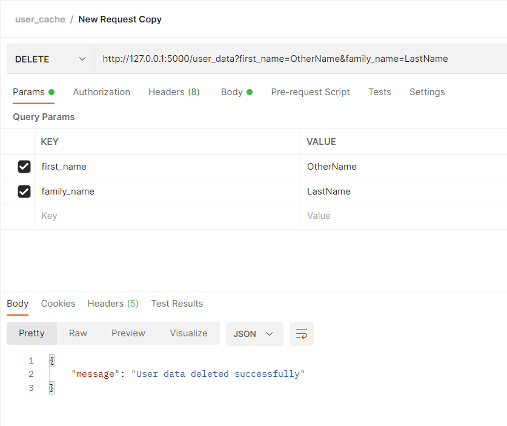

# User Cache Kata

## Instructions
A User is composed of:
- first_name
- family_name
- age
- job
- address
- biography

1. We need to implement a UserRepository with 3 methods :
- get_user
- add_user
- update_user
2. We’d like to add a cache for getUser method so that we don’t have to request real
UserRepository implementation (database or Rest based...) in case we try to retrieve
a same User several times in a row.
3. We can cache up to 10 different users.


## General information
1. The "test" module is used to test the "user_repository" module.
2. The "user_repository" has a dictionary based cache and a database mock.
3. The "db_api" module was created to test the user_cache with a more real scenario with a Flask based api and a SQLite database.
4. Install the required python modules with the requirements.txt file.

## Execution
#### 1. To run the tests, go to a terminal and run:
```
pytest
```
#### 2. To use the db_api, go inside the db_api directory and run: 
```
flask run
```
#### 3. Some requests that you can do to test the api and the cache:

##### 3.1. POST method
Send a json on the request body data with the following structure:


##### 3.2. GET method
Pass the the first_name and family_name parameters to get the user.
If you have already requested the user (by a GET, POST or PUT) and access it again with a GET method, it will be displayed with a True for the cached field:


If it wasn't accessed yet, it will be displayed as False for cached.


##### 3.3 PUT method
If you want to update a specific user, pass the the first_name and family_name parameters with the json data on the request body:


##### 3.4 DELETE method
If you want to delete an user, pass the the first_name and family_name parameters of the user you want to delete.


